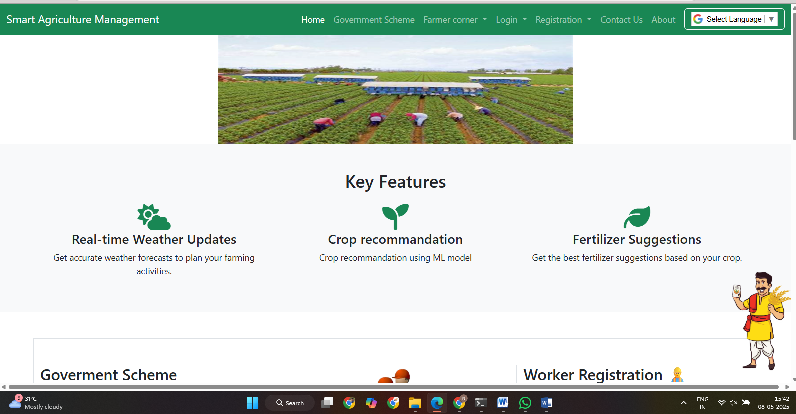

# 🌾 Smart Agriculture Portal

A Django-based web application for crop recommendation, worker management, and government scheme integration to support farmers and agricultural officers.

## 🏠 Home Page
The homepage allows users to:
- Access crop recommendation
- View available workers
- Navigate to different modules (dashboard, profile, login)
- Access weather information

 
---

## 📌 Features

- 🌱 **Crop Recommendation** using ML model (Decision Tree Classifier)
- 👨‍🌾 **Farmer and Worker Registration & Login**
- 👷 **Availability Status Toggle** for workers
- 📍 **Location-Based Filtering** (District → Sub-District → Village)
- 🌐 **Weather Forecast** for selected city
- 📑 **Government Scheme Management** (Add, View)
- 🧪 **Unit Testing** and CSRF protection

---

## 🛠 Technologies Used

| Technology | Purpose |
|------------|---------|
| Django     | Backend Framework |
| SQLite     | Lightweight Database |
| HTML/CSS/Bootstrap | Frontend Design |
| Scikit-learn | Machine Learning model |
| Joblib     | Model Serialization |
| JavaScript | Form validations & dropdowns |
| Font Awesome | Icons |
| W3Schools, Stack Overflow | Learning Resources |

---

## 📁 Project Structure
agriculture_portal/
├── ml_model/
│ └── crop_recommendation_model.pkl
├── templates/
│ ├── home.html
│ ├── dashboard.html
│ └── ...
├── static/
│ ├── css/
│ ├── js/
│ └── images/
├── app/
│ ├── views.py
│ ├── models.py
│ ├── urls.py
│ └── forms.py
└── manage.py

---

## ⚙️ Setup Instructions

1. **Clone the repository**  
```bash
git clone https://github.com/Nikhil7028/Smart-Agriculture-Management
cd Smart-Agriculture-Management

2. **Run migrations**  
python manage.py makemigrations
python manage.py migrate

3.**Load ML Model & Run the Server**
python manage.py runserver

4. **Visit**
Visit: http://localhost:8000

✅ Usage Notes
Workers can toggle their availability from the dashboard.

Officers can add new government schemes.

Farmers can view available workers and get crop recommendations.

Weather info can be retrieved from the "Weather" tab by entering the city name.
Note: Weather feature need to created the weather.html file and use weather api.

